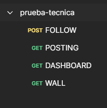

# Prueba Tecnica Java - Back

## Requerimientos Principales

- Que sea Web API (Java)
- El Front sera por Consola
- Contenga sus respectivas pruebas unitarias
- Que se aplique POO

### Se Valorara

- Aplicar conocimientos de SOLID
- Arquitetura Hexagonal

### Generales

(1)(1).png)
(1)(1).png)

<hr>   

# Proyecto

## Gerarquia final

```
.
└── src
    ├── main
    │   ├── java
    │   │   └── com
    │   │       └── example
    │   │           ├── SpringBootMain.java
    │   │           ├── Domain
    │   │           │   ├── Model
    │   │           │   │   ├── UserModel.java
    │   │           │   │   └── PostModel.java
    │   │           │   ├── Services
    │   │           │   │   ├── PostDomainService.java
    │   │           │   │   └── UserDomainService.java
    │   │           │   ├── Exceptions
    │   │           │   │   ├── AbstractDomainException.java
    │   │           │   │   └── Impls
    │   │           │   │       ├── UserModelException.java
    │   │           │   │       └── PostModelException.java
    │   │           │   └── Repositories
    │   │           │       ├── PostDomainRepository.java
    │   │           │       └── UserDomainRepository.java
    │   │           ├── Application
    │   │           │   ├── Commands
    │   │           │   │   ├── CreatePostCommand.java
    │   │           │   │   ├── FindByUsernameCommand.java
    │   │           │   │   ├── FindByUsernameFollowingEagerCommand.java
    │   │           │   │   └── FollowUserCommand.java
    │   │           │   ├── DTOs
    │   │           │   │   ├── CreatePostDTO.java
    │   │           │   │   ├── PostDTO.java
    │   │           │   │   └── UserDTO.java
    │   │           │   ├── Exceptions
    │   │           │   │   ├── AbstractApplicationException.java
    │   │           │   │   └── Impls 
    │   │           │   │           ├── AlreadyFollowingException.java 
    │   │           │   │           ├── UsernameIsNullOrBlankException.java 
    │   │           │   │           └── UserNotFoundException.java 
    │   │           │   ├── Handlers
    │   │           │   │   ├── CreatePostCommandHandler.java
    │   │           │   │   ├── FindByUsernameCommandHandler.java
    │   │           │   │   ├── FindByUsernameFollowingEagerCommandHandler.java
    │   │           │   │   └── FollowUserCommandHandler.java
    │   │           │   └── Services
    │   │           │       ├── UserApplicationServiceImpl
    │   │           │       ├── PostApplicationServiceImpl.java
    │   │           │       └── Interfaces
    │   │           │           ├── PostApplicationService.java
    │   │           │           └── UserApplicationService.java
    │   │           │   
    │   │           └── Infrastructure
    │   │               ├── Adapter
    │   │               │   ├── Input
    │   │               │   |   └── REST
    │   │               │   |       ├── PostController.java
    │   │               │   |       ├── UserController.java
    │   │               │   |       └── DTOs
    │   │               │   |           ├── CreatePostRequest.java
    │   │               │   |           └── FollowUserRequest.java
    │   │               │   └── Output
    │   │               │       ├── InMemoryPostRepository.java
    │   │               │       └── InMemoryUserRepository.java
    │   │               ├── Config
    │   │               │   └── SpringBoot
    │   │               │       ├── Beans.java
    │   │               │       └── CustomExceptionHandler.java
    │   │               └── Exceptions
    │   │                   ├── AbstractInfrastructureException.java
    │   │                   └── REST.java
    │   │                       └── MyResponseStatusException.java
    │   └── resources
    │       └── application.yml
    └── test
        └── java
            └── com
                └── example
                    ├── Suites.java
                    ├── Domain
                    │   └── Model
                    │       ├── PostModelTest.java
                    │       └── UserModelTest.java
                    ├── Application
                    |   ├── DTOs
                    |   |   ├── CreatePostDTOTest.java
                    |   |   ├── PostDTOTest.java
                    |   |   └── UserDTOTest.java
                    |   ├── Handlers
                    |   |   ├── CreatePostCommandHandlerTest.java
                    |   |   ├── FindByUsernameCommandHandlerTest.java
                    |   |   ├── FindByUsernameFollowingEagerCommandHandlerTest.java
                    |   |   └── FollowUserCommandHandlerTest.java
                    |   └── Services
                    |       ├── PostApplicationServiceImplTest.java
                    |       └── UserApplicationServiceImplTest.java
                    ├── Domain
                    |   └── Model
                    |       ├── PostModelTest.java
                    |       └── UserModelTest.java
                    └── Infrastructure
                        └── Adapter
                            ├── Input
                            |   └── REST
                            |       ├── PostControllerTest.java
                            |       └── UserControllerTest.java
                            ├── Output
                            |   ├── InMemoryPostRepositoryTest.java
                            |   └── InMemoryUserRepositoryTest.java
                            └── Config
                                └── SpringBoot
                                    ├── BeansTest.java
                                    └── CustomExceptionHandlerTest.java
```

